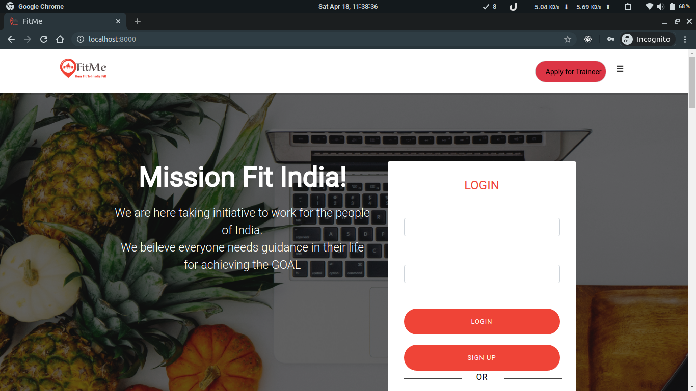

# FitMe
FitMe gym django based website 

## Abstract

If you have a gym membership or you're thinking about signing up for one, the most important thing to remember is that you have to use it. The advantages of gym workouts are that they provide several different ways to exercise, so going to the gym every day does not have to become boring and tedious.

## Types of Gym Workouts

Depending on the size of your fitness facility, you may have everything you need under one roof to get the awesome benefits of gym workouts. This includes:

- Cardio equipment. Most gyms are home to a few different pieces of cardio equipment such as stair climbers, rowing machines, spin bikes, recumbent bikes and treadmills. As long as you are healthy and able to participate in most types of exercise, consider alternating between these cardio machines to get your 30-plus minutes of cardio exercise, three to five days a week
- Strength training. Heading to the weight room at least two to three days each week will help keep your muscles strong, your bones healthy and allow you to control your weight. Focus on full-body workouts with exercises for each of the major muscle groups.
- Fitness classes. Access to group fitness classes is one of the advantages of gym workouts. Not only do you get the heart-pumping, muscle-building benefits of the exercises, but you also tap into the motivation and encouragement of working out with other people.
- Other recreational activities. Some larger facilities offer additional recreational activities such as swimming, racquetball, basketball, pickleball or an indoor track. Consider swapping out a few of these activities for your regular cardio workouts.

# Technology Used in the project 

## django - 
- Django is an open-source python web framework used for rapid development, pragmatic, maintainable, clean design, and secures websites. A web application framework is a toolkit of all components need for application development. The main goal of the Django framework is to allow developers to focus on components of the application that are new instead of spending time on already developed components. Django is fully featured than many other frameworks on the market. It takes care of a lot of hassle involved in the web development; enables users to focus on developing components needed for their application.

## html -
- Page layout has been designed in HTML.

## css -
- CSS has been used for all the designing part

## JavaScript -
- All the validation task and animations has been developed by JavaScript

# Features
- responsive bootstrap design
- trainer and trainee login and registration feature
- live feedback
- task system
- mail system
- BMI calculator

# Goals of the business
The Gym's goals are to allow their members to reach the highest level of fitness, while providing a safe and comfortable environment to live life to the fullest, healthiest potential. With that goal in mind, we are determined to create a top quality gym. We will have the highest degree of equipment. Our goal is within 3 years to expand our home location with a pool, racquetball court, basketball court, and a sauna with the use of our profits. We plan on mass promoting The Gym to our target market of 18 to 35 year olds. We will do gorilla marketing to promote the grand opening of The Gym through the use of social media and articles.

# Future Scope

A business website generally serves as a space to provide general information about your company or a direct platform for e-commerce. Regardless of whether you create a simple website that tells a little about your company or a more complex e-commerce site, the most important thing you must do is say, on the home page in plain terms, what your company does.

# Conclusion

The importance of  fitness and gym is growing up day by day,this website provide a simple interface to trainees and trainers 
to manage daily task and fulfils all the requirements of user and it provides an easy interface to navigate.We have used django/python and javascript to developed the
interface for keeping daily exercise tracker.
And help to improve your cardiovascular system, strengthen your muscles, help you maintain your weight, boost your mental health and decrease the odds that you'll develop other health conditions.

